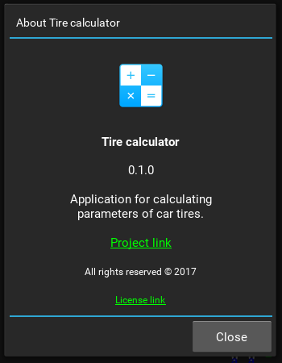

# Widgets KV
Set of widgets for the Kivy framework

## Requirements
- Python >= 3.6
- Kivy >= 1.10

## Installation
```shell
git clone https://github.com/Paduct/widgets_kv
```
```shell
pip install widgets_kv/
```

## Screenshot


